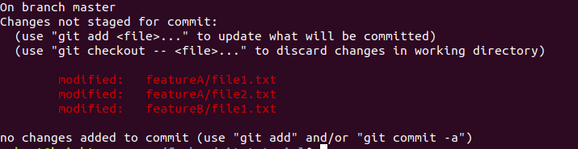
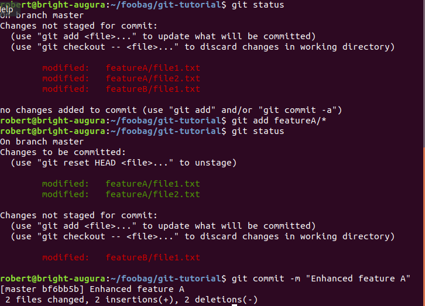
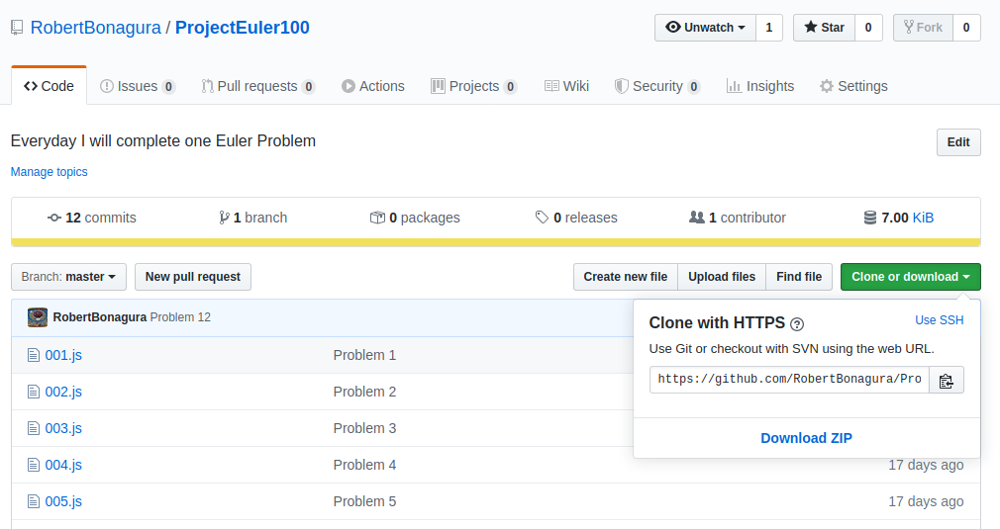

There are countless tutorials and StackOverflow answers supplying all the commands you need. However,
### Copying-and-pasting can only get you so far.

It may allow you to push your project onto GitHub. But once it comes time to manage a merge conflict, you're going to need to have a better understanding of these Git commands.

If you have no idea what I'm talking about, and just want to learn how to push your project to GitHub, then this article is for you. 

If you've already pushed to GitHub before, consider whether or not you can answer these questions.
* Why do files need to be staged for commit?
* How can I revert my changes from HEAD to a previous commit?
* What are the differences between pushing, merging and fetching?

If these questions sound confusing, or if you are unsure of their answers, you probably haven't had anyone explain them to you properly. And that's okay, that's just what I'm here for.

## First Things First

My biggest piece of advice starts with a simple reminder. Because Git is such a powerful tool, you can go down a rabbit hole in search of understanding all of the details. That is not what this article is for.

The goal of this article is **not** to tell you everything there is to know about Git. Instead, the goal is to show you all of the neccessary commands so that you can get started sharing your Git repository to GitHub -- and actually understand what is going on in the process.

If you want to one day be a Git Ninja, start here. Proficiency in the basics alone is enough to make you stand out among the crowd of new developers. As a student at Rutgers University, it's amazing how many students I have encoutered in classrooms and hackathons that have experience using Git, but struggle with some of the basic concepts.

By teaching other students what I'm going to share with you now, I've helped developers gain confidence and an understanding of Git. This not only makes for a better team, but gives a vital skill that is in demand by employers right now.

## Initializing Your Repository
The first thing we want to do is make sure you have Git installed on your machine by running
```
git --version
```
#### Download Git
If your terminal doesn't output your current Git version, or doesn't recognize the `git` command for that matter, you are going to need to download it from [Git's official website](https://git-scm.com/downloads).

Once you can can confirm that you have Git on your machine, you now must choose where to place your project directory.

#### Select a folder to push to GitHub
To follow along with this tutorial, I recomend choosing an actual project on your computer to push to GitHub. Just keep in mind that we are going to push this repository to GitHub, which means it is going to be made public. Make sure there is no private data in this folder. To learn more about keeping files within your repository private, see freeCodeCamp's guide on [how to use .gitignore files](https://guide.freecodecamp.org/git/gitignore/).

If you don't have a folder you want to share at this time, you can create one with a few sample text files for now. If you are running Mac or Linux, you can create a folder with some text values like this:
```
mkdir git-tutorial
cd git-tutorial
echo "Hello World" > hello.txt
echo "This is Great!" > optimistic-file.txt
```

### Now That You Have a Folder Selected
Run the below command in the root directory of the project you wish to place under version control.
```
git init
```
Voilà! It is a thing of beauty, is it not?

#### Can you find the .git folder?
So what happened? Let's take a look. Your repository shouldn't seem any different at first. Let's see what happens when you run the `ls` command with the `-a` option to reveal all hidden files.
```
$ ls -a
```
You should now see a sneaky hidden directory within your project.

This confirms that we have successfully created your repository. You're more than welcome to snoop around in there later, but for now I suggest coming back to this after you've gotten a firm grasp on the fundamentals of this tutorial. 

Right now all you need to understand is that all of the magic that makes Git happen resides inside this folder.

With each commit you make, you take a snapshot of the current state of your project. In response, any change is then recorded here. 

## Making Your First Commit

Because you just initialized your repository, the .git folder doesn't contain any commits yet. No snapshots have been taken yet. Let's create one. 

First thing we need to do is stage our files. Run the following command.
```
git status
```
This is how we can view all of our tracked and untracked files. Use `git add` to select the files. You can enter them explicity like this.
```
git add hello.txt
git add optimistic-file.txt
```
Or, you can add them all at once by using the `.` to inidicate that you want to add all files like this.
```
git add . 
```
After running either of the two methods above, if you run `git status` again you should see that all of your files are ready to be committed.

### Why Do We have to Stage Files Before Committing?
Isn't this a little redundant? It can be. Right now for instance it is, considering we want to commit everything in our repository. But the ability to stage files before committing them gives alot of version control power to the developer.

Pretend its 5:00pm and you're at work, ready to go home. 

You've been working on Feature A and Feature B for a few hours now. Feature A is all done, but Feature B still needs some work. You don't want to work all night and you don't want to commit Feature B because it will break your project. You do however, want to commit and push Feature A.

The above scenario might look something like this.



In this case it is really useful to simply run the commands shown below. 

Using the asterisk by the way, is shorthand for adding all files in the preceding folder.

As a result `git status` shows us



### Now That You've Staged All of Your Files,
You are ready to commit. All that's left is to run the following
```
git commit -m "First Commit"
```
The `-m` option allows you to provide a commit message. I recommend checking out Chris Beam's article on [How to Write a Git Commit Message](https://chris.beams.io/posts/git-commit/), but this will work for now.

Awesome job! You are now ready to push to GitHub.

## Pushing to Your Remote Repository

Keep in mind, you are going to have two repositories. You have already created a local repository managed by Git. Next, you are going to create a remote repository hosted by GitHub. This remote repository is designed to interact with the local repository.

#### Create a repository on GitHub
If you need help creating one, take a look at GitHub's [offical documentation](https://help.github.com/en/github/getting-started-with-github/create-a-repo) for creating a repository.

You can fork or clone anyone else's remote repository if it's made public, however you will not be able to push directly to it unless you own it or are are an invited collaborator. 

By default, you have access for all of your remote repositories so long as you update your Git configuration settings.

#### Update your Git configuration
You want to tell Git that you have a GitHub account. This will allow you to push and pull back and forth to your remote reposiory. 

Update your git configurations in such a way that Git can identify you and your GitHub account. This can be done simply by adding your name, and your email address (the one you created your GitHub account with), as arguments to the `git config` command.
```
git config --global user.name "Your name in quotes"
git config --global user.email "inQuotes@yourEmail.com"
```
By passing in the `--global` option now, you save yourself from having to set up your git configuration settings in every local repository you create.

Now is also a good time to add in your preferred text editor if you have one. I prefer Vim.
```
git config --global core.editor vim
```
### Add Your Remote Repository
To define a remote repository, you will run 
```
git remote add origin <remote-repository-URL>
```
For the remote repository URL, click the green "Clone or download" button pictured below and copy the link that emerges. For now, just clone with HTTPS, though I suggest learning how to [clone with SSH](https://help.github.com/en/github/authenticating-to-github/connecting-to-github-with-ssh) at some point later.



This URL is the same as the remote repository's main page URL. You can copy the link from your browser, just be sure to append `.git` on to the end of it.

#### What is origin?

We use `origin` to name the local repository's reference to the remote repository. This may seem like an arbitrary name, however it is standard convention to name the remote repository associated with your local repository this. 

Anytime you choose to clone a remote repository, the newly created local repository will refer to this remote repository as `origin` by default.

### Time to Push
To do this, simply run 
```
git push <remote-name> <remote-branch-name>
```
By default your remote repository will contain a single branch named master.

You can learn about creating and switching branches [here](https://git-scm.com/book/en/v2/Git-Branching-Branches-in-a-Nutshell), the documentation is pretty straight-forward.

And that's it. You've just pushed to GitHub!

## Conclusion
My suggestion after following along to this tutorial is to continue using Gitt and GitHub for all personal projects. Even essays or word documents. 

After incorporating this into your workflow starts to feel more natural, it will be much easier to pursue learning some of the more advanced features and functionality that Git has to offer.